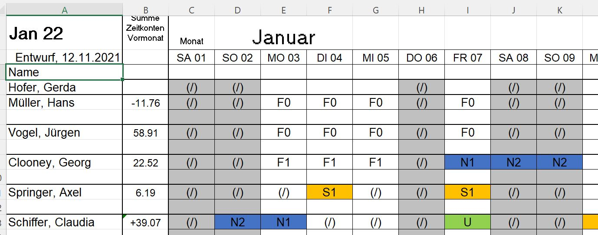

# Roster2cal
> Convert a roster defined in an excel to an ics file. Note: This is a personal project to save myself and my wife the time of manually adding her work shifts from an Excel/PDF roster to our shared Google Calendar. 


The input is a roster defined in an excel file that looks similar to the screenshot below. The output is an ics file that can be imported to most calendars. 
(see [full example here](data/202201_example_roster.xlsx))


As a secondary purpose, I needed a small project to try out nbdev for development :).

## Install

`pip install roster2ical`

## How to use

```
from pathlib import Path
from roster2ical.roster import ShiftProperties, Roster
from datetime import timedelta

_abbr2shiftproperties = {
    "F1": ShiftProperties(
        name="Früh1", starting_hour=timedelta(hours=8), duration=timedelta(hours=8)
    ),
    "N1": ShiftProperties(
        name="Nacht1", starting_hour=timedelta(hours=22), duration=timedelta(hours=10)
    ),
}
r = Roster.from_dict(
    {
        "Mo 01": "F1",
        "Di 02": "N1",
    },
    mapper=_abbr2shiftproperties,
)

with (Path.cwd() / "data" / "output" / "example.ics").open("w") as f:
    f.write(str(r.to_ics()))
```
